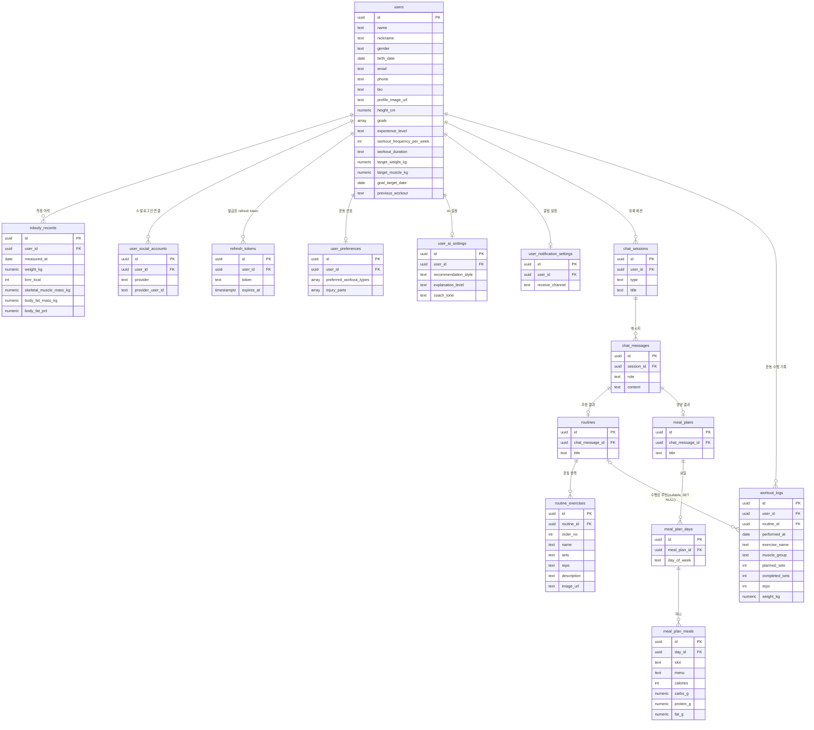

# DB 설계 (PostgreSQL / MVP)

`architecture.md`의 스키마 스케치를 실제 DDL로 확정한 문서. 스키마의 단일 출처(single source of truth)는 이 파일이다.

> **[2026-07 갱신] 회원가입/프로필 화면 대응**
> - `users`: 기본 프로필(닉네임·생년월일·이메일·전화·자기소개·이미지), 운동 목표(`goals` 복수), 운동 경력·계획(빈도·시간·목표수치) 컬럼 추가. `target_gain_kg` 제거.
> - `inbody_records`: `body_fat_pct`(체지방률) 추가. 체중은 이 테이블에만 유지(회원가입 = 인바디 입력).
> - 신설: `user_preferences`(운동 선호), `user_ai_settings`(AI 맞춤 설정), `user_notification_settings`(알림 설정).
> - '계정·보안'(비번/2단계인증/소셜연동)은 인증 도입 단계로 미룸.
>
> **[2026-07 갱신] 구글 소셜 로그인 도입**
> - 신설: `user_social_accounts` — `users`에 컬럼을 얹지 않고 별도 테이블로 분리. 유저 1명이 여러
>   provider(구글, 추후 카카오 등)를 연결할 수 있는 구조.
> - 신설: `refresh_tokens` — 세션이 아닌 JWT(Access/Refresh Token) 방식 채택. 둘 다 JWT이며,
>   Refresh Token은 발급한 토큰 문자열을 DB에도 그대로 저장해 로그아웃 시 그 행만 지우면
>   즉시 무효화할 수 있게 한다(서명 검증 + DB 존재 확인 하이브리드).
>
> **[2026-08 갱신] 운동 수행 기록 — `workout_logs` 신설 (`POST`/`GET /api/workout-logs`, `api.md` 3.5~3.6)**
> - AI 추천 루틴 수행 기록과 사용자 자유 입력 기록을 한 테이블에 담는다. `routine_id`는
>   nullable — null이면 자유 입력, 값이 있으면 어떤 AI 루틴을 수행했는지를 가리킨다.
> - `routine_id`는 `on delete set null`(cascade 아님). `routines`는 `chat_messages`에
>   cascade로 매달려 있어, 여기서도 cascade를 걸면 채팅 세션을 지울 때 운동 이력이 함께
>   삭제되어 버린다 — 운동 이력은 그 세션/루틴이 사라져도 독립적으로 남아야 한다.
> - `muscle_group`은 nullable로 시작 — AI 응답(`api.md` 4.2)에 부위 필드가 추가되면
>   그때 채워진다. 지금은 백엔드가 채울 방법이 없다.

## 1. 전제

- DB는 PostgreSQL, 백엔드(Railway)가 **유일한 DB 클라이언트**다. 프론트/AI 서버는 DB에 직접 접근하지 않는다.
- 구글 소셜 로그인 + JWT(Access/Refresh Token)로 유저를 식별한다 (고정 더미 유저 방식은 폐기, 4장 참고).
- 인바디는 시계열 데이터다 (와이어프레임 "Last Data 2026.06.20", 막대 그래프).

## 2. ERD



## 3. DDL

DB 클라이언트(psql/pgAdmin 등)에 바로 붙여넣을 실행 순서대로 합친 스크립트는 [`schema.sql`](./schema.sql)에 있다.
아래는 테이블별 설계 근거와 함께 보는 설명용이며, 스키마를 바꿀 때는 이 문서와 `schema.sql`을 함께 수정한다.

### users

기본 프로필·운동 목표·운동 계획. 측정할 때마다 바뀌지 않는 프로필 속성을 담는다.
회원가입1(기본정보/운동목표/운동환경)과 프로필 "기본 프로필"·"운동 목표" 탭에 대응.

```sql
create table users (
  id               uuid primary key default gen_random_uuid(),
  name             text not null,                                     -- 이름
  nickname         text,                                              -- 닉네임
  gender           text check (gender in ('MALE', 'FEMALE')),         -- 성별 (소셜 로그인 직후엔 미입력)
  birth_date       date,                                              -- 생년월일
  email            text,                                              -- 이메일(표시용, 인증 추후)
  phone            text,                                              -- 휴대전화 번호
  bio              text,                                              -- 자기소개
  profile_image_url text,                                             -- 프로필 이미지 URL
  height_cm        numeric(4,1) check (height_cm > 0),                -- 키 (소셜 로그인 직후엔 미입력)

  -- 운동 목표(복수 선택). 허용값(백엔드 검증):
  --   MUSCLE_GAIN, FAT_LOSS, FITNESS, POSTURE, REHAB, HABIT
  goals            text[] not null default '{}',

  -- 운동 경력: UNDER_6M, M6_1Y, Y1_2Y, OVER_2Y
  experience_level text check (experience_level in ('UNDER_6M','M6_1Y','Y1_2Y','OVER_2Y')),

  workout_frequency_per_week integer check (workout_frequency_per_week between 1 and 7), -- 주당 횟수
  workout_duration text check (workout_duration in ('UNDER_30','M60','M90','OVER_120')), -- 1회 시간
  target_weight_kg numeric(4,1),                                      -- 목표 체중
  target_muscle_kg numeric(4,1),                                      -- 목표 골격근량
  goal_target_date date,                                              -- 목표 달성 예정일

  previous_workout text check (previous_workout in ('UPPER_BODY', 'LOWER_BODY')), -- 전날 운동
  created_at       timestamptz not null default now()
);
```

- 대부분의 컬럼이 nullable — 회원가입 스텝을 나중에 완성하거나("나중에 설정") 목표 미설정 상태가 존재한다.
- `gender`/`height_cm`도 nullable이다 — 구글 소셜 로그인 직후엔 이름 정도만 있고 성별·키는 아직
  입력되지 않은 상태라, 최초 계정 생성 시점엔 채울 수 없다. 프로필 완성 단계에서 채운다.
- `goals`는 복수 선택이라 배열(`text[]`). Postgres 배열엔 CHECK를 걸기 번거로워 **허용값 검증은 백엔드에서** 한다.
- 회원가입 시 여러 스텝의 입력을 마지막에 한 번에 저장한다 → 개별 컬럼은 nullable로 두고 최종 저장 시 채운다.
- '계정·보안'(비밀번호/2단계인증)은 인증 도입 단계로 미뤄 이 테이블에 포함하지 않는다. 소셜 로그인
  연결 정보는 `user_social_accounts`(다음 절)에 별도로 둔다.

### user_social_accounts

소셜 로그인 연결 정보. `users`에 컬럼을 얹지 않고 별도 테이블로 분리했다 — `user_preferences` 등
기존 1:1 보조 테이블과 같은 패턴이다. 유저 1명이 여러 provider(구글, 추후 카카오 등)를 연결할 수
있는 구조라 provider가 늘어나도 `users` 스키마 변경이 필요 없다.

```sql
create table user_social_accounts (
  id               uuid primary key default gen_random_uuid(),
  user_id          uuid not null references users(id) on delete cascade,
  provider         text not null check (provider in ('GOOGLE')), -- 추후 KAKAO 등 추가
  provider_user_id text not null,                                -- 구글 sub
  created_at       timestamptz not null default now(),
  unique (provider, provider_user_id),
  unique (user_id, provider)
);
```

- `unique (provider, provider_user_id)`: 같은 구글 계정이 서로 다른 유저에 중복 연결되는 것을 막는다.
- `unique (user_id, provider)`: 한 유저가 같은 provider를 두 번 연결하는 것을 막는다.

### refresh_tokens

로그인 세션 대신 JWT(Access/Refresh Token) 방식을 쓴다. Access Token은 서명만 검증하는
stateless JWT라 DB에 저장하지 않는다. Refresh Token도 JWT이지만, 발급한 토큰 문자열을 이
테이블에 그대로 저장해둔다 — 검증 시 서명뿐 아니라 DB에 그 행이 아직 있는지도 확인해서,
로그아웃/연동 해제 시 행만 지우면 만료 전이라도 즉시 무효화할 수 있다.

```sql
create table refresh_tokens (
  id         uuid primary key default gen_random_uuid(),
  user_id    uuid not null references users(id) on delete cascade,
  token      text not null unique,
  expires_at timestamptz not null,
  created_at timestamptz not null default now()
);
```

### inbody_records

체중·기초대사량·골격근량·체지방량·체지방률. 메인 하단 패널은 이 중 최신 1건을 표시한다.
회원가입2(인바디 측정 입력)와 프로필 "신체 정보"에 대응 — 회원가입은 인바디 측정값을 입력받는 단계다.

```sql
create table inbody_records (
  id                      uuid primary key default gen_random_uuid(),
  user_id                 uuid not null references users(id) on delete cascade,
  measured_at             date not null,                                    -- "Last Data" 표기
  weight_kg               numeric(5,2) not null check (weight_kg > 0),      -- 체중
  bmr_kcal                integer      not null check (bmr_kcal > 0),       -- 기초대사량
  skeletal_muscle_mass_kg numeric(5,2) not null check (skeletal_muscle_mass_kg > 0), -- 골격근량
  body_fat_mass_kg        numeric(5,2) not null check (body_fat_mass_kg >= 0),       -- 체지방량
  body_fat_pct            numeric(4,1)          check (body_fat_pct >= 0),           -- 체지방률(%)
  created_at              timestamptz not null default now(),
  unique (user_id, measured_at)
);

create index idx_inbody_user_measured
  on inbody_records (user_id, measured_at desc);
```

- 인덱스는 `GET /api/inbody/recent`의 "유저의 최신 1건" 조회 패턴에 대응한다 (`where user_id = ? order by measured_at desc limit 1`).
- 체중은 이 테이블에만 둔다 — 회원가입 시 입력한 키·체중도 인바디 측정값의 일부로 여기에 저장하며, users에 중복 보관하지 않는다.
- 화면 항목은 골격근량·체지방량·체지방률·기초대사량 4종이다 (BMI·내장지방·허리둘레는 미포함).
- 인바디 입력은 사용자 직접 입력으로 확정, 회원가입2에서 측정값을 입력받는다(`POST /api/inbody`, `api.md` 3.1c).
  "인바디 없이 시작" 옵션은 제거되어 인바디는 항상 입력된다 — 그래서 `weight_kg`/`bmr_kcal`/
  `skeletal_muscle_mass_kg`/`body_fat_mass_kg`가 다른 프로필 컬럼과 달리 not null이다.

### user_preferences

프로필 "운동 선호 설정" 탭 중 순수 선호(다중선택)만 담는다. 유저 1:1.
장소·운동수준·보유기구 항목은 화면 개편으로 제거되어 포함하지 않는다.

```sql
create table user_preferences (
  id         uuid primary key default gen_random_uuid(),
  user_id    uuid not null unique references users(id) on delete cascade,
  -- 선호 운동: WEIGHT, BODYWEIGHT, CARDIO, STRETCHING, FUNCTIONAL
  preferred_workout_types text[] not null default '{}',
  -- 불편한 부위: NECK, SHOULDER, ELBOW, WAIST, KNEE, WRIST, ANKLE, NONE
  injury_parts            text[] not null default '{}',
  created_at timestamptz not null default now(),
  updated_at timestamptz not null default now()
);
```

`user_id`에 `unique`를 걸어 유저당 1행을 강제한다. 두 값 모두 다중선택이라 배열이며,
허용값 검증은 백엔드에서 한다. `injury_parts`는 운동 추천 조절용 참고 정보이지 의학적 진단이 아니다.

### user_ai_settings

프로필 "AI 맞춤 설정" 탭. 유저 1:1. 단일선택 3종과 자동추천 토글 5종.

```sql
create table user_ai_settings (
  id         uuid primary key default gen_random_uuid(),
  user_id    uuid not null unique references users(id) on delete cascade,
  recommendation_style text check (recommendation_style in ('SAFETY','EFFECT','SIMPLE','EXPLORE')), -- 추천 방식
  explanation_level    text check (explanation_level in ('SIMPLE','STANDARD','DETAILED')),          -- 설명 수준
  coach_tone           text check (coach_tone in ('CALM','PRO','MOTIVATION','CONCISE')),            -- 코치 말투
  auto_daily_routine    boolean not null default true,   -- 오늘의 운동 루틴 추천
  auto_intensity_adjust boolean not null default true,   -- 운동 기록 기반 강도 조절
  auto_weakpart_alert   boolean not null default true,   -- 부족한 운동 부위 알림
  auto_restday_suggest  boolean not null default false,  -- 휴식일 추천
  auto_posture_tip      boolean not null default true,   -- 운동 자세 주의사항 제공
  created_at timestamptz not null default now(),
  updated_at timestamptz not null default now()
);
```

이 설정은 AI 코칭 호출 시 컨텍스트로 실려 응답 성향을 조절한다 (context assembler가 조립).

### user_notification_settings

프로필 "알림 설정" 탭. 유저 1:1. 알림 토글 7종과 수신 방식.

```sql
create table user_notification_settings (
  id         uuid primary key default gen_random_uuid(),
  user_id    uuid not null unique references users(id) on delete cascade,
  notify_workout_start   boolean not null default true,   -- 운동 시작 알림
  notify_weekly_goal     boolean not null default true,   -- 주간 목표 진행 알림
  notify_long_absence    boolean not null default true,   -- 장기간 미운동 알림
  notify_ai_recommend    boolean not null default false,  -- AI 추천 루틴 알림
  notify_body_update     boolean not null default true,   -- 신체 정보 업데이트 알림
  notify_workout_summary boolean not null default true,   -- 운동 기록 요약 알림
  notify_service_event   boolean not null default false,  -- 서비스 공지 및 이벤트
  receive_channel text not null default 'APP' check (receive_channel in ('APP','EMAIL','SMS')), -- 수신 방식
  created_at timestamptz not null default now(),
  updated_at timestamptz not null default now()
);
```

MVP는 알림 발송 자체를 구현하지 않을 수 있으나, 설정값은 화면 유지를 위해 저장한다.

### chat_sessions

좌측 "최근 채팅내역" 목록. "새 채팅시작"이 새 행을 만든다.

```sql
create table chat_sessions (
  id         uuid primary key default gen_random_uuid(),
  user_id    uuid not null references users(id) on delete cascade,
  type       text not null check (type in ('COACHING', 'NUTRITION')),
  title      text,
  created_at timestamptz not null default now()
);

create index idx_chat_sessions_user_created
  on chat_sessions (user_id, created_at desc);
```

`type`이 세션에 붙는 이유: 코칭/영양은 우측 탭으로 분리된 별개 대화 맥락이므로, 세션 하나가 두 AI를 오가지 않는다.

### chat_messages

대화 메시지 본문. AI 생성 결과(운동루틴/식단표)는 아래 `routines`/`meal_plans`가 이 테이블을
참조하는 방식으로 붙는다 — 이 테이블 자체는 결과를 담지 않는다.

```sql
create table chat_messages (
  id         uuid primary key default gen_random_uuid(),
  session_id uuid not null references chat_sessions(id) on delete cascade,
  role       text not null check (role in ('USER', 'ASSISTANT')),
  content    text not null,
  created_at timestamptz not null default now()
);

create index idx_chat_messages_session_created
  on chat_messages (session_id, created_at);
```

인덱스는 세션 상세 조회(`where session_id = ? order by created_at`)와 AI 호출 시 대화 이력 조립에 함께 쓰인다.

### routines / routine_exercises

코칭 AI 결과. 어시스턴트 메시지 1건당 루틴 0~1개, 루틴 1개당 운동 여러 개.
와이어프레임의 운동루틴 카드(운동명 / 상세 설명 / 3~4세트 8~12회 / 이미지)에 대응.

```sql
create table routines (
  id              uuid primary key default gen_random_uuid(),
  chat_message_id uuid not null unique references chat_messages(id) on delete cascade,
  title           text not null,
  created_at      timestamptz not null default now()
);

create table routine_exercises (
  id           uuid primary key default gen_random_uuid(),
  routine_id   uuid not null references routines(id) on delete cascade,
  order_no     integer not null check (order_no > 0),  -- 카드 내 노출 순서
  name         text not null,                          -- "등업"
  sets         text not null,                           -- "3~4세트"
  reps         text not null,                           -- "8~12회"
  description  text,
  image_url    text,
  unique (routine_id, order_no)
);
```

`chat_message_id`에 `unique`를 걸어 메시지 1건당 루틴을 최대 1개로 제한한다.
`sets`/`reps`는 "3~4세트"처럼 범위 표기라 숫자로 쪼개지 않고 텍스트 그대로 저장한다 —
집계가 필요해지면(예: 세트 수 평균) 그때 최소/최대 숫자 컬럼으로 분리한다.

### meal_plans / meal_plan_days / meal_plan_meals

영양 AI 결과. 주간 식단표(MON~SUN × 아침/점심/저녁)에 대응하는 3단 구조.

```sql
create table meal_plans (
  id              uuid primary key default gen_random_uuid(),
  chat_message_id uuid not null unique references chat_messages(id) on delete cascade,
  title           text not null,
  created_at      timestamptz not null default now()
);

create table meal_plan_days (
  id            uuid primary key default gen_random_uuid(),
  meal_plan_id  uuid not null references meal_plans(id) on delete cascade,
  day_of_week   text not null check (day_of_week in ('MON','TUE','WED','THU','FRI','SAT','SUN')),
  unique (meal_plan_id, day_of_week)
);

create table meal_plan_meals (
  id         uuid primary key default gen_random_uuid(),
  day_id     uuid not null references meal_plan_days(id) on delete cascade,
  slot       text not null check (slot in ('BREAKFAST', 'LUNCH', 'DINNER')),
  menu       text not null,
  calories   integer check (calories >= 0),
  carbs_g    numeric(5,1),
  protein_g  numeric(5,1),
  fat_g      numeric(5,1),
  unique (day_id, slot)
);
```

`unique (meal_plan_id, day_of_week)`와 `unique (day_id, slot)`이 각각 "하루는 요일당 1행",
"한 끼는 슬롯당 1행"을 강제한다 — 같은 날 아침이 중복 저장되는 경우가 구조적으로 불가능하다.

### workout_logs

사용자의 운동 수행 기록. AI 추천 루틴을 수행한 기록과 사용자가 직접 입력한 자유 기록을
한 테이블에 담는다 — 대시보드 "운동 수행 기록" 기능. API는 `api.md` 3.5(`POST`)/3.6(`GET`) 참고.

```sql
create table workout_logs (
  id             uuid primary key default gen_random_uuid(),
  user_id        uuid not null references users(id) on delete cascade,
  routine_id     uuid references routines(id) on delete set null,
  performed_at   date not null,
  exercise_name  text not null,
  muscle_group   text check (muscle_group in
                   ('CHEST', 'BACK', 'SHOULDER', 'ARM', 'LOWER_BODY', 'CORE', 'CARDIO')),
  planned_sets   integer check (planned_sets > 0),
  completed_sets integer check (completed_sets >= 0),
  reps           integer check (reps > 0),
  weight_kg      numeric(5,2) check (weight_kg >= 0),
  created_at     timestamptz not null default now()
);

create index idx_workout_logs_user_performed
  on workout_logs (user_id, performed_at desc);
```

- `routine_id`는 **nullable + `on delete set null`**(cascade 아님). null이면 사용자 자유 입력,
  값이 있으면 어떤 AI 루틴을 수행했는지를 가리킨다. `routines`는 `chat_messages`에 cascade로
  매달려 있는데, 여기서도 cascade를 걸면 채팅 세션이 삭제될 때 운동 이력까지 통째로 사라진다 —
  운동 이력은 세션/루틴의 생명주기와 독립적으로 남아야 하므로 SET NULL을 택했다.
- `muscle_group`은 nullable. AI 응답(`api.md` 4.2 `result.routine.exercises[]`)에 부위
  필드가 아직 없어 지금은 백엔드가 채울 방법이 없다 — 필드가 추가되는 대로 채워진다.
- `planned_sets`는 루틴 수행 시점의 추천 세트 수 스냅샷이다. `routine_id`가 나중에
  SET NULL로 끊기더라도(루틴/세션 삭제) 완료율(`completed_sets` / `planned_sets`) 계산에
  필요한 값이 남아있도록 별도 컬럼으로 스냅샷을 떠 둔다.
- 인덱스는 "유저의 수행 기록을 최신순으로 조회"(`where user_id = ? order by performed_at desc`)
  패턴에 대응한다 — `inbody_records`의 `idx_inbody_user_measured`와 같은 이유.

## 4. 시드 (더미 유저) — 폐기됨

로그인이 없던 초기 MVP 단계에서 백엔드가 설정값으로 고정 유저 id를 참조하던 방식. 아래 시드와
`app.mvp.dummy-user-id` 프로퍼티는 구글 소셜 로그인 + JWT 도입 이후 더 이상 쓰지 않는다 —
`UserService.getCurrentUser()`가 `SecurityContext`의 실제 로그인 유저를 조회하도록 바뀌었다.
과거 방식 기록으로만 남겨둔다.

```sql
insert into users (id, name, gender, height_cm, previous_workout)
values ('00000000-0000-0000-0000-000000000001',
        '홍길동', 'MALE', 175.0, 'UPPER_BODY');
```

## 5. 설계 판단

**enum 대신 text + CHECK.** Postgres 네이티브 enum은 값 추가가 번거롭고 삭제가 불가능하다. MVP 단계에서
운동 부위·AI 타입은 바뀔 가능성이 높으므로, CHECK 제약이 변경 비용이 낮다. 값이 굳으면 그때 enum으로 옮긴다.

**운동/식단을 처음부터 정규화.** 애초 안은 `chat_messages.result` jsonb 한 컬럼에 통째로 저장하는
것이었다 — AI와 결과 스키마를 합의하는 중이라 구조가 바뀔 여지가 크다는 이유였다. 이번에 정규화로
전환하면서 그 트레이드오프가 뒤집혔다: 운동/끼니 단위로 조회·집계("종합 데이터")할 수 있게 되는 대신,
AI 응답에 필드가 추가·변경될 때마다 컬럼 마이그레이션이 필요해진다. `sets`/`reps`처럼 아직 세부
구조가 불확실한 값은 텍스트 컬럼으로 남겨 이 비용을 낮췄다.

**RLS 미적용.** RLS(Row Level Security)는 클라이언트가 DB에 직접 붙을 때의 방어 수단이다. 이 구조에서는
백엔드만 DB에 접근하고 권한 판단도 백엔드가 하므로 MVP에서는 켜지 않는다. 다만 나중에 프론트가 DB에
직접 붙는 설계가 나오면 그 시점에 반드시 재검토해야 한다.

**소셜 로그인은 `users`에 컬럼을 얹지 않고 `user_social_accounts`로 분리했다.** 구글 하나만 있을 땐
컬럼 하나(`auth_provider_id` 등)로도 충분하지만, 카카오 등 다른 provider를 추가로 연결할 계획이라
처음부터 별도 테이블로 뺐다 — provider가 늘어도 `users` 스키마 변경이 없다.

**cascade 삭제.** 유저 삭제 시 인바디·세션이, 세션 삭제 시 메시지가, 메시지 삭제 시 그 메시지의
루틴/식단표(및 하위 운동·요일·끼니)가 함께 지워진다. 고아 행이 남을 경로가 없다.

## 6. 적용에 필요한 것

현재 `build.gradle`에는 DB 관련 의존성이 없다. DB 작업을 시작하려면 추가가 필요하다.

```gradle
implementation 'org.springframework.boot:spring-boot-starter-data-jpa'
runtimeOnly 'org.postgresql:postgresql'
```

**연결 방식: 로컬은 직접 접속.** (Supabase/Supavisor 풀러는 더 이상 쓰지 않는다.)

```properties
# application.properties (커밋됨) — url/username은 값을 비워두고 로컬에서 채운다
spring.profiles.active=local
spring.datasource.url=
spring.datasource.username=
```

비밀번호는 커밋되는 파일에 두지 않는다.

- **로컬**: `application-local.properties`(gitignore 대상)에 `spring.datasource.password=…`
- **Railway**: 환경변수 `SPRING_DATASOURCE_PASSWORD` 등록. Spring의 relaxed binding이
  `spring.datasource.password`로 매핑하며, 환경변수가 프로퍼티 파일보다 우선하므로
  `spring.profiles.active=local`이 켜져 있어도 Railway 값이 이긴다.

프로덕션(Railway) DB를 어디에 호스팅할지, 커넥션 풀러를 쓸지는 아직 미결이다 (7장 참고).
결정되면 이 절을 그 환경의 접속 방식에 맞춰 갱신한다.

DDL 적용은 MVP에서는 DB 클라이언트(psql/pgAdmin 등)에서 직접 실행한다. 스키마 변경이 잦아지면 Flyway 도입을 검토한다.
(`spring.jpa.hibernate.ddl-auto`는 운영 DB에 쓰지 않는다.)

## 7. 미결 사항

- **`unique (user_id, measured_at)`** — 하루 1회 측정을 가정했다. 하루 여러 번 측정을 허용해야 하면
  이 제약을 빼고 `measured_at`을 `timestamptz`로 바꾼다.
- **`chat_sessions.title` 생성 규칙 미정** — 첫 사용자 메시지를 잘라 쓰는 방식을 가정하고 nullable로 뒀다.
- **"최근 채팅내역" 정렬 기준** — 현재 `created_at`(세션 생성순). 마지막 대화순으로 정렬해야 하면
  `updated_at` 컬럼 추가가 필요하다.
- **"종합 데이터" 화면 요구사항 미정** — 어떤 집계가 필요한지에 따라 `routine_exercises`/
  `meal_plan_meals`에 인덱스가 추가로 필요할 수 있다 (예: 운동명별 빈도 집계라면 `name` 인덱스).
- **AI 응답 스키마가 이 DDL과 다르게 확정될 경우** — 정규화된 구조라 jsonb 때보다 마이그레이션
  비용이 크다. AI 서버와 `architecture.md` 4장의 `result` 스키마를 합의할 때 이 문서와 나란히 맞춰야 한다.
- **프로덕션 DB 호스팅** — Supabase 사용 중단은 확정. 로컬은 PostgreSQL로 전환 완료했으나
  Railway 배포 환경의 DB(호스팅처, 풀러 여부)는 아직 미결이다.
- **`workout_logs.muscle_group` 채우는 주체** — AI 응답에 부위 필드가 추가될 때까지는
  값이 항상 null이 된다. AI 서버와 `api.md` 4.2 계약에 부위 필드를 추가할지, 백엔드가
  운동명으로 매핑할지 아직 정하지 않았다.
